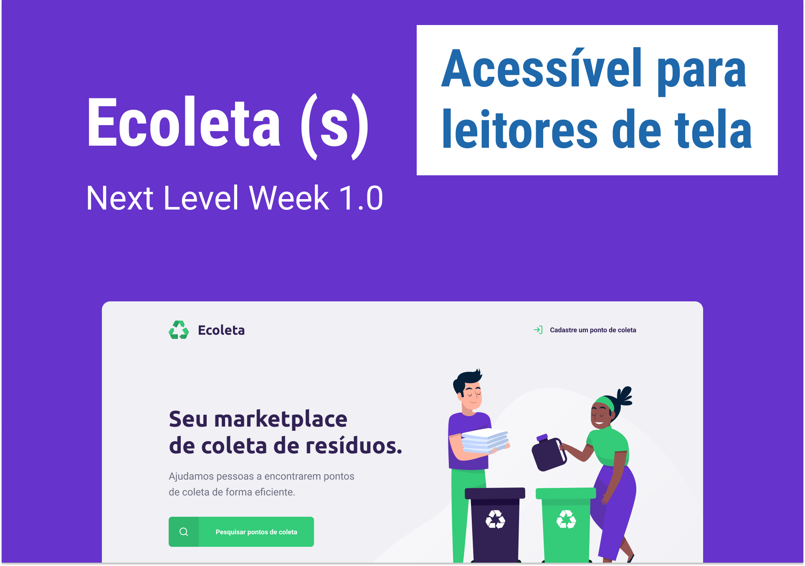

<h1 align="center">
  
</h1>

## Sobre

O **Ecoleta** é uma aplicação web de coleta de resíduos, desenvolvida na trilha Starter do evento **Next Level Week**, sob as aulas do instrutor da Rocketseat **Mayk Brito**, de 01/06/2020 a 05/06/2020, no qual é possível:

1. Cadastrar um ponto de coleta.
1. Buscar os pontos de coleta cadastrados por cidade.
1. Visualizar os pontos cadastrados.

Essa aplicação .

## Tecnologias utilizadas
- HTML
- CSS
- Javascript
- Node.js
- Git Bash
- Express
- Nunjunks
- SQLite

