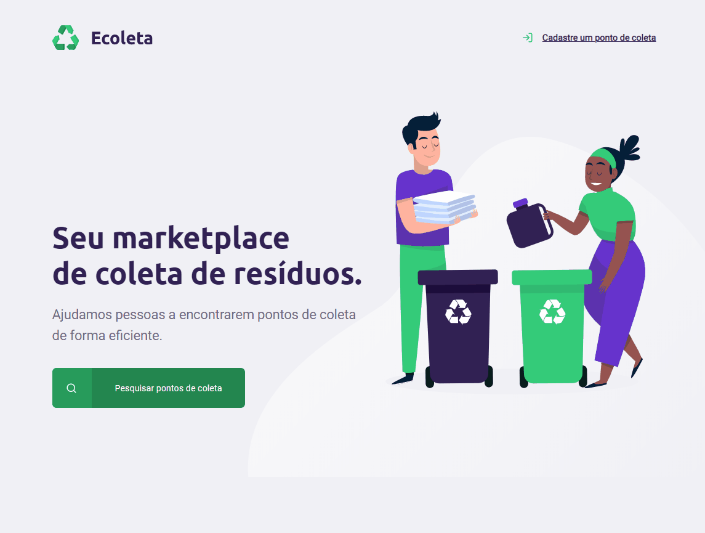

<h1 align="center">
  
</h1>


# Índice

- [Sobre](#information_source-sobre)
- [Tecnologias utilizadas](#-tecnologias-utilizadas)
- [Melhorias Implementadas](#diamond_shape_with_a_dot_inside-melhorias-implementadas)
- [Como baixar o projeto](#arrow_double_down-como-baixar-o-projeto)
- [Interface](#computer-interface)

## :information_source: Sobre

O **Ecoleta** é uma aplicação web de coleta de resíduos, desenvolvida na trilha Starter do evento **Next Level Week**, sob as aulas do instrutor da [Rocketseat](https://rocketseat.com.br/) **[Mayk Brito](https://github.com/maykbrito)**, no qual é possível:

1. Cadastrar um ponto de coleta.
1. Buscar os pontos de coleta cadastrados por cidade.
1. Visualizar os pontos cadastrados.

---

## 🚀 Tecnologias utilizadas
- HTML
- CSS
- Javascript
- Node.js
- Git Bash
- Express
- Nunjunks
- SQLite

---

## :diamond_shape_with_a_dot_inside: Melhorias implementadas
Algumas melhorias foram adicionadas ao projeto-base, como:
- Mobile first
- Progressive enhancement
- BEM (Block Element Modifier)
- Responsividade
- Aplicação de técnicas e conceitos para a acessibilidade 🔝

---

## :arrow_double_down: Como baixar o projeto

```bash
  
  # Clonar repositório
  $ git clone https://github.com/NayraCruz/ecoleta.git
  
  # Entrar no diretório
  $ cd ecoleta
  
  # Instalar as dependências
  $ npm install
  
  # Iniciar o projeto
  $ npm start
```

---

## :computer: Interface
Demonstração do resultado final da aplicação:




<p align="center"><strong>Por <a href="https://www.linkedin.com/in/nayra-cruz/">Nayra Cruz 💁</a></strong></p>
